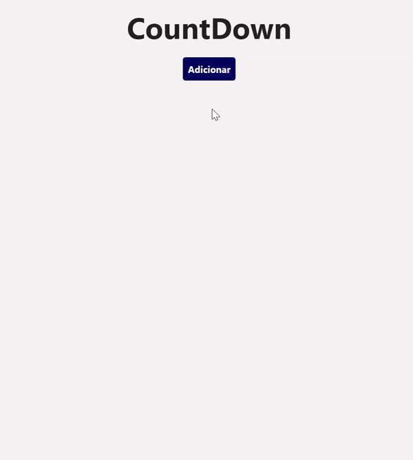

<h1 align="center">
    <a href="https://imgbb.com/"></a>
</h1>

<p align="center">
  <a href="#-tecnologias">Tecnologias</a>&nbsp;&nbsp;&nbsp;|&nbsp;&nbsp;&nbsp;
  <a href="#-projeto">Projeto</a>&nbsp;&nbsp;&nbsp;|&nbsp;&nbsp;&nbsp;
  <a href="#-licença">Licença</a>
</p>

<p align="center">
  
</p>

<br>

<p align="center">
  
</p>

## 🚀 Tecnologias

Tecnologias utilizadas durante o projeto:

- [React Native](https://reactnative.dev/)
- [JavaScript](https://www.javascript.com/)
- [Expo](https://expo.dev/)
- [CSS](https://developer.mozilla.org/pt-BR/docs/Web/CSS)
- [Eslint](https://eslint.org/)
- [EditorConfig](https://editorconfig.org/)

## ⭐ Funcionalidades implantadas - Front-end
- Utilização do pacote react-native-countdown-component para a contagem regressiva
- Ações de evento como adicionar e deletar
- Componentes Reutilizaveis como o Modal (Registra a atividade e inicia a contagem)
- Organização dos componentes e pastas (components, pages e utils)

## 💻 Projeto

Um countDown de dias que permite você realizar o registro de um evento inserindo quantidade de dias, título e descrição (seja ele um compromisso, atividade e entre outros) 
através de um modal (componente reutilizável) que faz uma contagem regressiva até a data estipulada pelo usuário e permite deletar a atividade 😄.

Este projeto é um desafio técnico oferecido pela [VilaApps](https://www.vilaapps.com.br/).

## 😎 Iniciando 

📖 Para rodar o projeto localmente você precisará seguir algumas instruções.

- É necessário que o <a href="https://nodejs.org/en/">NodeJS</a> esteja instalado em sua máquina.
- É necessário ter o aplicativo <a href="https://expo.dev/">Expo</a> esteja instalado em seu celular.
- É necessário utilizar <a href="https://classic.yarnpkg.com/en/">Yarn</a> ou <a href="https://www.npmjs.com/">Npm</a> para a instalação de pacotes.

### Instalação

```bash
# Clone o repositório
git clone https://github.com/larissadantier/countdown.git

# Instale todos os pacotes

- Npm
npm install

- Yarn
yarn install

```

## Contribuições

```
Você quer contribuir para o projeto e não sabe como? 💜

1. Dê Fork no projeto
2. Crie uma branch para sua feature (`git checkout -b feature/AmazingFeature`)
3. Comite as alterações (`git commit -m 'Add some AmazingFeature'`)
4. Faça o push para a branch (`git push origin feature/AmazingFeature`)
5. Abra um Pull Request
```
## 📝 Licença

Esse projeto está sob a licença MIT. Veja o arquivo [LICENSE](LICENSE) para mais detalhes.

---

## 👀 Autor
<div align="center">
  <a href="https://app.rocketseat.com.br/me/larissadantier">
   
  </a>
</div>
<br/>
<p align="center">Desenvolvido por Larissa Dantier 🚀 </p> 
<p align="center">Entre em contato! 👏 </p>
<div align="center">
<a href="https://www.linkedin.com/in/larissadantier/" target="_blank">
    
  </a>&nbsp;&nbsp;
 <a href="https://www.instagram.com/larissa.dantier/" target="_blank">
            
  </a>&nbsp;&nbsp;
 <a href="mailto:larissa_dantier@hotmail.com">
            
  </a>&nbsp;&nbsp; 
</div>
    


